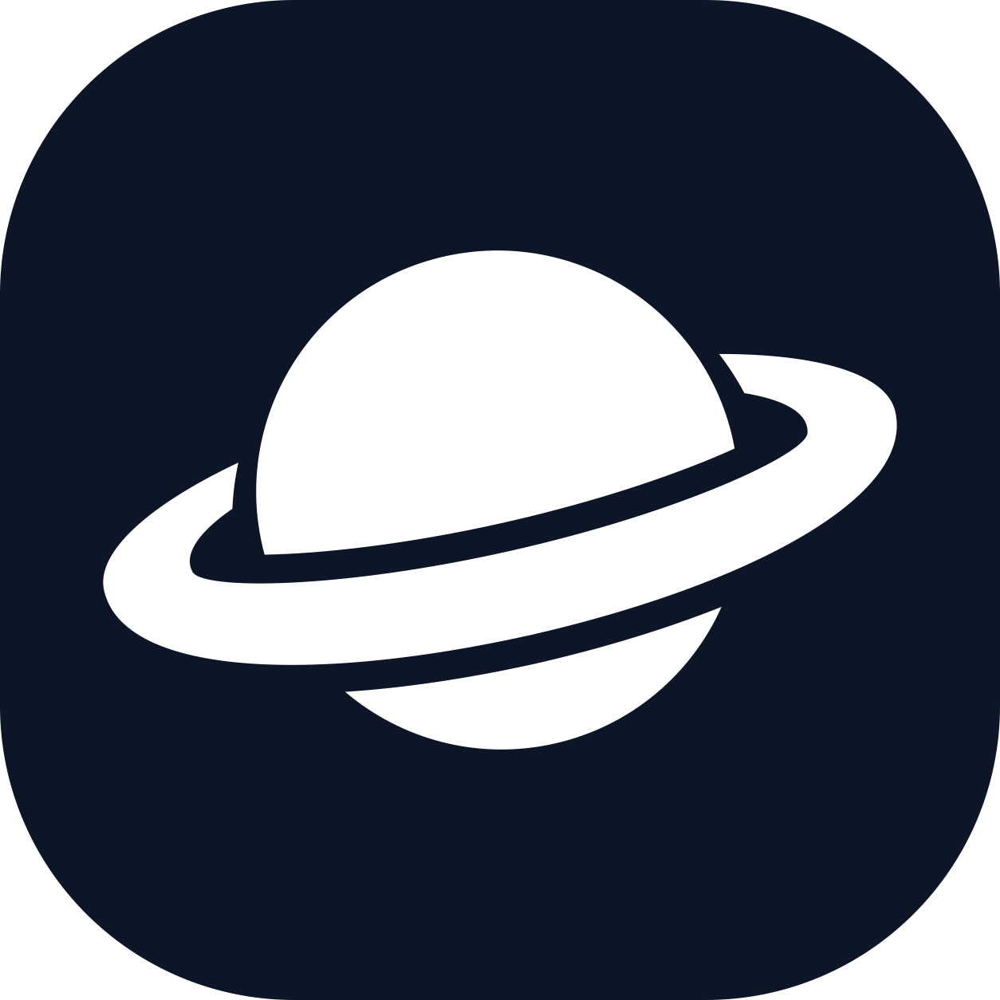

<p align="center">
  
</p>

<h1 align="center">Cronus Launcher</h1>

<p align="center">Multi-account Roblox launcher with automatic rejoin, resource controls, and executor support.</p>

<p align="center">
  <a href="https://github.com/xspww/Khabarovsk/releases"></a>
  <a href="https://github.com/xspww/Khabarovsk/actions/workflows/release.yml"></a>
  
  
</p>

<p align="center">
  English | <a href="README.th.md">ไทย</a>
</p>

<p align="center">
  <a href="#overview">Overview</a> •
  <a href="#features">Features</a> •
  <a href="#requirements">Requirements</a> •
  <a href="#installation">Installation</a> •
  <a href="#quick-start-from-source">Quick Start</a> •
  <a href="#build-from-source">Build</a> •
  <a href="#in-game-lua-script">Lua Script</a> •
  <a href="#data-and-privacy">Privacy</a>
</p>


## Overview

Cronus Launcher manages multiple Roblox accounts from a single desktop dashboard. It monitors game sessions, rejoins automatically on disconnect, and keeps CPU, memory, and graphics load under control when running several clients on one machine.

## Features

- **Multi-account management** — Add, organize, and launch multiple Roblox accounts from one dashboard.
- **Automatic rejoin** — Detect disconnections and rejoin the configured server without manual intervention.
- **Resource controls** — CPU limiter, RAM management, FPS limit, low-graphics mode, and window layout controls for multi-instance sessions.
- **Executor support** — Track executor compatibility against the official Roblox version, with optional auto-relaunch flow.
- **Roblox version management** — Check the official client version, install or update the player, and clean up old versions.
- **Local-first security** — Account cookies and credentials are encrypted on the host with Windows DPAPI and never sent to external servers.

## Requirements

| Component | Requirement |
| --------- | ----------- |
| OS | Windows 10 or Windows 11, 64-bit |
| Runtime (release build) | None — the `.exe` from Releases is standalone |
| Runtime (from source) | Python 3.11 or later |
| Game client | Roblox Player installed on the host |

## Installation

Recommended for most users. No Python required.

1. Open the [Releases page](https://github.com/xspww/Khabarovsk/releases).
2. Download `CronusLauncher-<version>.exe` and run it.
3. Optional portable build: `CronusLauncher-<version>-portable.zip` contains `CronusLauncher.exe` and `Api.lua`. The executable keeps a stable file name so in-place updates replace it; `Api.lua` is the loader script to run in your executor.

### Verify the download

```powershell
(Get-FileHash CronusLauncher-<version>.exe -Algorithm SHA256).Hash
```

Compare the output with the SHA256 value published on the release page.

### Updates and signatures

- The in-app updater works with compiled release builds on Windows and requires an internet connection. It does not apply to source checkouts.
- Each release artifact is signed with the project release key. The application verifies the signature and SHA256 digest before installing an update. No certificate setup is required on the user side.
- The executable is not signed with a commercial Windows publisher certificate, so Windows SmartScreen may show a warning on first run. Download only from the Releases page linked above.
- If the executable is stored in a protected location such as `Program Files`, the updater requests administrator approval before writing. Without administrator access, move the executable to a user-writable folder.

## Quick Start (from source)

1. Clone the repository:

```powershell
git clone https://github.com/xspww/Khabarovsk.git
cd Khabarovsk
```

2. Install dependencies:

```powershell
python -m pip install -r requirements.txt
```

3. Start the launcher using one of the following methods:

```powershell
.\Run.cmd
```

```powershell
python main.py
```

The launcher starts the local service on `127.0.0.1` and opens the desktop dashboard.

## Build from source

```powershell
python -m pip install -r requirements.txt pyinstaller
python -c "from PIL import Image; Image.open('assets/cronus_icon.png').save('assets/cronus_icon.ico')"
pyinstaller cronus_launcher.spec
```

Output: `dist/CronusLauncher.exe`

GitHub Actions builds releases the same way when a `v*` tag is pushed. The tag must match `APP_VERSION` in `version.py`.

## In-Game Lua Script

The loader script accelerates rejoin telemetry when executed inside the game client. Run the following file in your Roblox executor:

```text
lua/run_in_executor.lua
```

The portable release archive ships the same file as `Api.lua` next to the executable.

## Data and Privacy

Runtime configuration and account state are stored locally at:

```text
%LOCALAPPDATA%\Cronus Launcher\data
```

- Account cookies are encrypted with Windows DPAPI on the host.
- Cookies are never transmitted to external servers and are never committed to the repository.
- When a new version is available, the launcher provides a button that opens the Releases page. The local data directory is left untouched during updates.
