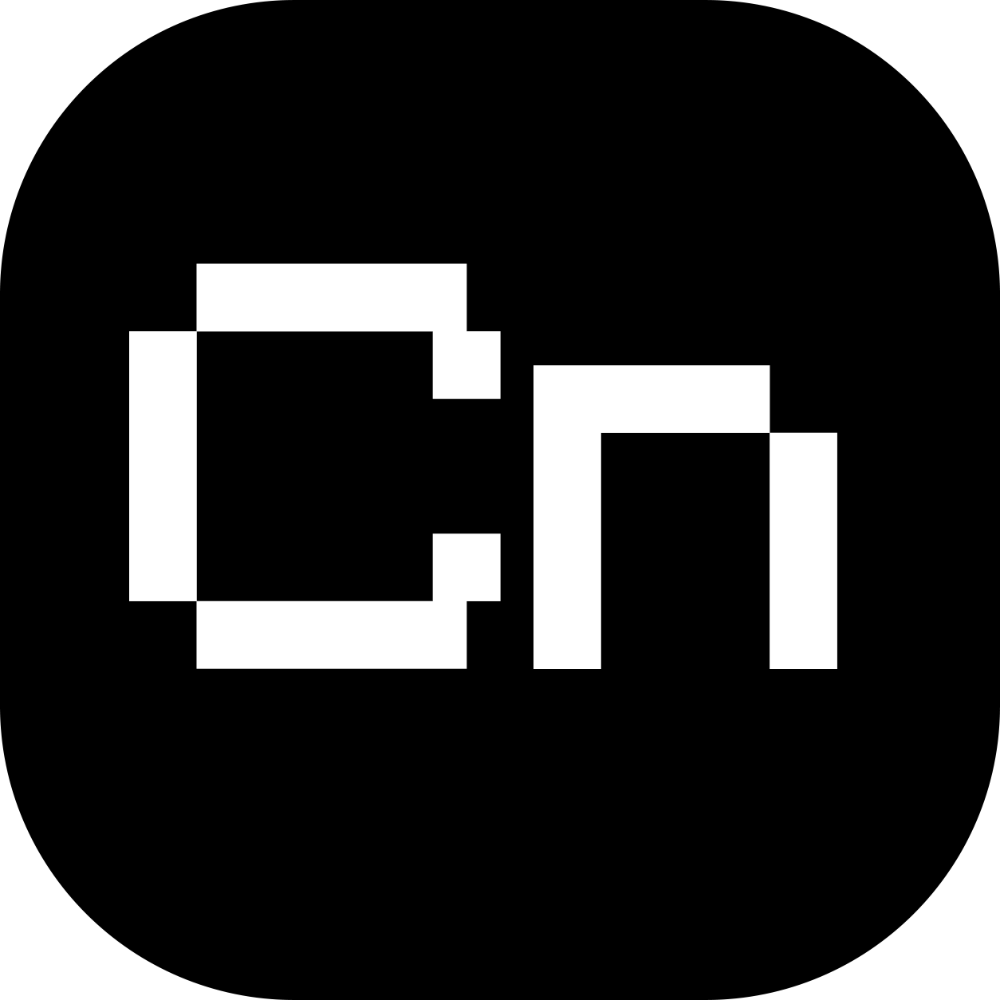

<p align="center">
  
</p>

<h1 align="center">Cronus Launcher</h1>

<p align="center">ตัวจัดการหลายบัญชี Roblox พร้อมรีจอยอัตโนมัติ</p>

<p align="center">
  <a href="https://github.com/xspww/Khabarovsk/releases"></a>
  <a href="https://github.com/xspww/Khabarovsk/actions/workflows/release.yml"></a>
  
  
</p>

<p align="center">
  <a href="README.md">English</a> | ไทย
</p>

<p align="center">
  <a href="#ฟีเจอร์">ฟีเจอร์</a> •
  <a href="#สิ่งที่ต้องมี">สิ่งที่ต้องมี</a> •
  <a href="#ติดตั้ง">ติดตั้ง</a> •
  <a href="#เริ่มใช้จากซอร์ส">เริ่มใช้</a> •
  <a href="#สร้างไฟล์-exe">สร้าง exe</a> •
  <a href="#สคริปต์-lua-ในเกม">Lua</a> •
  <a href="#ข้อมูลและความเป็นส่วนตัว">ความเป็นส่วนตัว</a> •
  <a href="#ความตั้งใจ">ความตั้งใจ</a>
</p>


## ฟีเจอร์

มีอะไรให้ใช้บ้าง:

- 👥 จัดการหลายบัญชีพร้อมกัน: เหมือน Roblox account manager
- 🔄 ตัวโปรแกรมจะเข้าเกมให้อัตโนมัติ: นอนอยู่มันก็เข้าเกมให้
- ⚡ ลดโหลดเครื่อง: จำกัด CPU กับลดกราฟิกลงได้ พอเปิดหลายจอเครื่องก็ยังไหว
- 🧩 ต่อกับ executor ได้: รีตัวรันสคริปต์ Roblox ให้ถ้าตัวรันอัพเดท หยุดเข้าเกมให้หาก Roblox อัพเดท
- 🔒 เก็บความลับไว้บนเครื่อง: เข้ารหัส cookie กับรหัสผ่านด้วย Windows DPAPI บนเครื่องตัวเอง ไม่ส่งออกไปไหน

## สิ่งที่ต้องมี

เครื่องต้องพร้อมตามนี้:

- Windows 10 หรือ Windows 11 64-bit
- Python 3.11 ขึ้นไป
- ลง Roblox ไว้บนเครื่องแล้ว

## ติดตั้ง

วิธีง่ายสุดคือโหลดตัว build สำเร็จจากหน้า Releases ไม่ต้องลง Python เพิ่ม

1. เปิด `https://github.com/xspww/Khabarovsk/releases`
2. โหลด `CronusLauncher-<version>.exe` แล้วรันได้เลย
3. ตัว portable `CronusLauncher-<version>-portable.zip` ข้างในมี exe ตัวเดียวกันพร้อม Lua loader

ตัวอัปเดตในแอปใช้ได้กับไฟล์ exe จาก Releases บน Windows เท่านั้น และต้องต่ออินเทอร์เน็ต ถ้าไฟล์อยู่ในโฟลเดอร์ที่ต้องใช้สิทธิ์ผู้ดูแลระบบ เช่น `Program Files` ระบบจะแสดง UAC ให้ยืนยันก่อนเขียนไฟล์ หากไม่มีสิทธิ์ผู้ดูแลระบบ ให้วาง exe ในโฟลเดอร์ของผู้ใช้ เช่น Downloads รุ่นที่รันจากซอร์สไม่รองรับ self-update

workflow จะเซ็นไฟล์ exe และ portable archive ด้วยกุญแจ release ของโปรเจกต์ โปรแกรมตรวจลายเซ็นและ SHA256 ก่อนติดตั้ง update กุญแจนี้ดูแลในฝั่งโปรเจกต์ ผู้ใช้ไม่ต้องติดตั้ง certificate หรือปรับค่า update เอง เนื่องจาก exe ไม่ได้ใช้ certificate เชิงพาณิชย์ของ Windows, SmartScreen อาจยังแสดงคำเตือนตามปกติเมื่อดาวน์โหลดรุ่นใหม่ ให้โหลดจากหน้า Releases ด้านบนเท่านั้น SHA256 ใช้ตรวจไฟล์เสียหาย ส่วนลายเซ็นใช้ยืนยันว่าไฟล์มาจากโปรเจกต์นี้

ถ้า Windows SmartScreen เตือน ให้ตรวจว่าโหลดจากหน้า Releases ด้านบน การตรวจลายเซ็นของโปรแกรมยังคงทำงานก่อน update แม้ Windows จะแสดงคำเตือนนี้

```powershell
(Get-FileHash CronusLauncher-2.5.1.exe -Algorithm SHA256).Hash
```

## เริ่มใช้จากซอร์ส

ทำตามนี้:

1. Clone repo:

```powershell
git clone https://github.com/xspww/Khabarovsk.git
cd Khabarovsk
```

2. ลง dependencies:

```powershell
python -m pip install -r requirements.txt
```

3. เปิด launcher เลือกวิธีใดวิธีหนึ่ง ถ้าใช้ batch runner รันคำสั่งนี้:

```powershell
.\Run.cmd
```

ถ้าใช้ Python รันคำสั่งนี้:

```powershell
python main.py
```

พอรันแล้ว service ก็ขึ้นที่ 127.0.0.1 พร้อมเปิดหน้าจอ dashboard ให้เอง

## สร้างไฟล์ exe

```powershell
python -m pip install -r requirements.txt pyinstaller
python -c "from PIL import Image; Image.open('assets/cronus_icon.png').save('assets/cronus_icon.ico')"
pyinstaller cronus_launcher.spec
```

ผลลัพธ์อยู่ที่ `dist/CronusLauncher.exe` ฝั่ง Releases ก็ build ด้วยวิธีเดียวกันผ่าน GitHub Actions ทุกครั้งที่ดัน tag `v*` ชื่อ tag ต้องตรงกับ `APP_VERSION` ใน `version.py`

## สคริปต์ Lua ในเกม

สคริปต์ loader (ตัวโหลดโค้ด telemetry เข้าเกม) ช่วยให้รีจอยไวขึ้น อยากส่ง telemetry แล้วรีจอยเร็วขึ้นก็เอาไฟล์นี้ไปรันใน executor ของ Roblox:

```text
lua/run_in_executor.lua
```

## ข้อมูลและความเป็นส่วนตัว

config กับสถานะบัญชีเก็บไว้บนเครื่องตรงนี้:

```text
%LOCALAPPDATA%\Cronus Launcher\data
```

cookie ของบัญชีเข้ารหัสด้วย Windows DPAPI บนเครื่องตัวเอง ไม่ส่ง cookie ออกไปเซิร์ฟเวอร์ข้างนอก ไม่ commit cookie ลง repo ถ้ามีเวอร์ชันใหม่ โปรแกรมจะขึ้นปุ่มให้กดไปโหลด exe จากหน้า Releases มาแทนไฟล์เดิมเอง โฟลเดอร์ data ด้านบนไม่แตะเลย

## ความตั้งใจ
โปรแกรมนี้สร้างขึ้นเพื่อ คนทำไก่ตัน จะได้ประหยัดต้นทุน เป็นโปรแกรม opensource จะนำโปรแกรมไปดัดแปลงอะไรก็ได้
